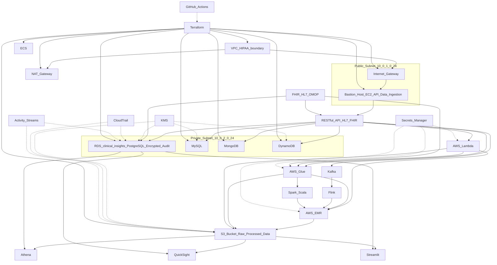

# About Boston Scientific

Boston Scientific transforms lives through innovative medical technologies that improve the health of patients around the world. As a global medical technology leader for more than 40 years, we advance science for life by providing a broad range of high-performance solutions that address unmet patient needs and reduce the cost of health care. Our portfolio of devices and therapies helps physicians diagnose and treat complex cardiovascular, respiratory, digestive, oncological, neurological and urological diseases and conditions.

# Role Relevance: Medical Data Specialist II

This project demonstrates:
- Secure, HIPAA-compliant cloud data architecture (AWS, Terraform)
- Automated ETL pipelines and real-time data ingestion (Python, Spark, Lambda)
- Clinical data modeling (PostgreSQL, FHIR/HL7-ready schemas)
- API/data delivery design (RESTful, HL7/FHIR integration planned)
- Automation, monitoring, and compliance (CI/CD, CloudTrail, encryption)

# Skills Demonstrated

- **ETL Development:** Automated pipelines with Python, Spark, AWS Glue
- **Data Modeling:** Clinical schemas in PostgreSQL, FHIR/HL7-ready
- **Cloud Platforms:** HIPAA-compliant AWS setup
- **Programming:** Python, SQL, Spark
- **APIs & Integration:** (Planned) RESTful, HL7/FHIR
- **Automation:** Terraform, GitHub Actions

# Architecture Diagram (Mermaid)

