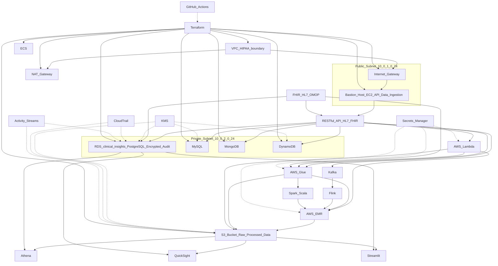

---

## Data Privacy & Access Controls

### Current State

- All data is processed and stored locally by default.
- Sensitive fields (e.g., patient name, DOB) are present in raw and processed data.
- No explicit data anonymization or pseudonymization is performed.
- Data validation ensures only schema-compliant data is processed and stored.
- Invalid or malformed data is moved to a separate folder (`data/invalid`) for review.
- Local access is controlled by OS-level file permissions.
- S3 bucket (cloud) is configured to block all public access (via Terraform).
- IAM user/policy restricts S3 access to only required actions for the telemetry bucket.
- No hardcoded secrets; all credentials and paths are loaded from environment variables or `.env` files.
- No direct exposure of sensitive data via APIs or web endpoints (yet).

### Recommendations

- Implement data anonymization or masking for PHI/PII before storage or analytics.
- Encrypt sensitive data at rest (e.g., enable S3 bucket encryption, use encrypted databases).
- Use IAM roles with least-privilege access for all cloud resources.
- Enable audit logging (e.g., AWS CloudTrail) for all data access and changes.
- Regularly review and rotate credentials and access keys.
- Document and enforce access policies for all team members and services.
- Prepare a data retention and deletion policy for compliance.
# About Boston Scientific

# PulseGuard Clinical Data Pipeline

This project is a secure, automated ETL and analytics pipeline for clinical telemetry data, designed for HIPAA-compliant cloud and local environments. It demonstrates best practices in data engineering, security, and compliance for a Medical Data Specialist II role.


Boston Scientific transforms lives through innovative medical technologies that improve the health of patients around the world. As a global medical technology leader for more than 40 years, we advance science for life by providing a broad range of high-performance solutions that address unmet patient needs and reduce the cost of health care. Our portfolio of devices and therapies helps physicians diagnose and treat complex cardiovascular, respiratory, digestive, oncological, neurological and urological diseases and conditions.

# Role Relevance: Medical Data Specialist II

This project demonstrates:
- Secure, HIPAA-compliant cloud data architecture (AWS, Terraform)
- Automated ETL pipelines and real-time data ingestion (Python, Spark, Lambda)
- Clinical data modeling (PostgreSQL, FHIR/HL7-ready schemas)
- API/data delivery design (RESTful, HL7/FHIR integration planned)
- Automation, monitoring, and compliance (CI/CD, CloudTrail, encryption)

# Skills Demonstrated

- **ETL Development:** Automated pipelines with Python, Spark, AWS Glue
- **Data Modeling:** Clinical schemas in PostgreSQL, FHIR/HL7-ready
- **Cloud Platforms:** HIPAA-compliant AWS setup
- **Programming:** Python, SQL, Spark
- **APIs & Integration:** (Planned) RESTful, HL7/FHIR
- **Automation:** Terraform, GitHub Actions

# Architecture Diagram (Mermaid)

---

## Setup Instructions

### Prerequisites
- Python 3.8+
- [pip](https://pip.pypa.io/en/stable/)
- (Optional) AWS CLI & Terraform for cloud deployment


1. **Clone the repository and navigate to the project root.**
2. **Create and activate a Python virtual environment:**
     ```sh
     python3 -m venv venv
     source venv/bin/activate
     ```
3. **Copy and edit the `.env` file:**
    - All configuration (paths, credentials, SMTP, etc.) is managed via `.env`.
    - Never commit secrets to version control.
    - Example:
      ```env
      PG_RAW_DIR=data/raw
      PG_PROCESSED_DIR=data/processed
      PG_INVALID_DIR=data/invalid
      PG_SCHEMA_PATH=pipeline/telemetry_schema.json
      PG_DB_PATH=pipeline/telemetry.db
      PG_SMTP_SERVER=smtp.gmail.com
      PG_SMTP_PORT=587
      PG_SMTP_USER=your_email@gmail.com
      PG_SMTP_PASS=your_app_password
      PG_ALERT_EMAIL=your_email@gmail.com
      ```
3. **Install dependencies:**
     ```sh
     pip install -r requirements.txt
     ```

4. **Directory structure:**
    - `pipeline/`: All ETL, analytics, alerting, and schema code
    - `data/raw/`: Raw telemetry JSON files
    - `data/processed/`: Validated and transformed files
    - `data/invalid/`: Invalid/malformed files
    - `logs/`: Pipeline logs
    - `terraform/`: Infrastructure as code (AWS S3, IAM, etc.)
    - `tests/`: Unit and integration tests

## Usage Instructions

### Automated Workflow

- **Generate test data, run ETL, and analytics (all automated):**
    ```sh
    python run_all.py
    ```

### Manual Steps
- **Run ETL pipeline only:**
    ```sh
    python pipeline/etl.py
    ```
- **Run analytics and export results:**
    ```sh
    python pipeline/analytics.py
    ```
- **Run unit tests:**
    ```sh
    PYTHONPATH=. pytest tests/
    ```

### Logging & Monitoring
- All pipeline steps log to `logs/pipeline.log` (INFO, WARNING, ERROR).
- `pipeline/alert_on_log.py` scans logs for warnings/errors and sends email alerts (configure SMTP in `.env`).

## Deployment

### Local
- All data is processed and stored locally by default.

- **Infrastructure:**
    - Use Terraform files in `terraform/` to provision AWS resources (S3, IAM, etc.).
    - Run `terraform init` and `terraform apply` in the terraform directory when ready to deploy.
- **Git:**
    - Use `git add .`, `git commit`, and `git push` to version and deploy code.

### Cloud (AWS)
- S3 bucket and IAM user/policy are provisioned via Terraform for least-privilege access.
- S3 bucket is versioned, encrypted, and blocks all public access.
- Update ETL to use S3 for file I/O and RDS/PostgreSQL for database in production.
- Never store secrets in code or commit `.env` to version control.

## Data Schema

See `pipeline/telemetry_schema.json` for the full JSON schema.

Each telemetry JSON file must include:

| Field        | Type    | Required | Notes                        |
|--------------|---------|----------|------------------------------|
| DeviceID     | string  | Yes      | Unique device identifier     |
| PatientName  | string  | Yes      | Patient's name               |
| DOB          | string  | Yes      | Date of birth (YYYY-MM-DD)   |
| BPM          | integer | Yes      | Heart rate, >=0              |
| SpO2         | integer | Yes      | Oxygen saturation, 0-100     |
| Timestamp    | string  | Yes      | ISO timestamp                |

## Pipeline Flow

1. **Test Data Generation:** `pipeline/generate_test_data.py` creates valid/invalid telemetry files for testing.
2. **ETL Pipeline:** `pipeline/etl.py` validates, transforms, logs, and stores data. Invalid files are moved to `data/invalid/`.
3. **Analytics:** `pipeline/analytics.py` summarizes and exports patient data to CSV and visualizations.
4. **Alerting:** `pipeline/alert_on_log.py` scans logs and emails alerts for warnings/errors.

1. **Data Generation:** Synthetic telemetry data is created and placed in `data/raw/`.
2. **ETL Pipeline:**
     - Validates and transforms data (adds ingestion timestamp, uppercases name).
     - Valid files are moved to `data/processed/` and inserted into `pipeline/telemetry.db`.
     - Invalid files are moved to `data/invalid/` with error logging.
3. **Analytics:**
     - Summarizes and visualizes data, exports results to `patient_summary.csv`.

## Error Handling

- All errors and warnings are logged to `logs/pipeline.log`.
- Invalid data is never inserted into the database or analytics.

- Invalid or malformed data is logged and moved to `data/invalid/`.
- Only valid, schema-compliant data is processed and stored.

## Testing

- Tests cover data transformation, schema validation, and error handling.
- Add more tests in `tests/` as the pipeline evolves.
## Configuration & Secrets Management

- All paths, credentials, and settings are loaded from environment variables or `.env` (see Setup).
- Never hardcode secrets or commit `.env` to version control.
- Use AWS Secrets Manager or SSM Parameter Store for production secrets.

## Logging & Monitoring

- Structured logging is implemented for all pipeline steps.
- Alerts are sent via email for warnings/errors (see Usage).
- For production, integrate with AWS CloudWatch, CloudTrail, and enable audit logging.

## Cloud Adaptation

- Update ETL to read/write files from S3 using `boto3`.
- Use RDS/PostgreSQL for scalable, compliant storage.
- All infrastructure is defined in `terraform/` (S3, IAM, encryption, access policies).

---

- Unit and integration tests are in the `tests/` directory.
- Run all tests with:
    ```sh
    PYTHONPATH=. pytest tests/
    ```

---


