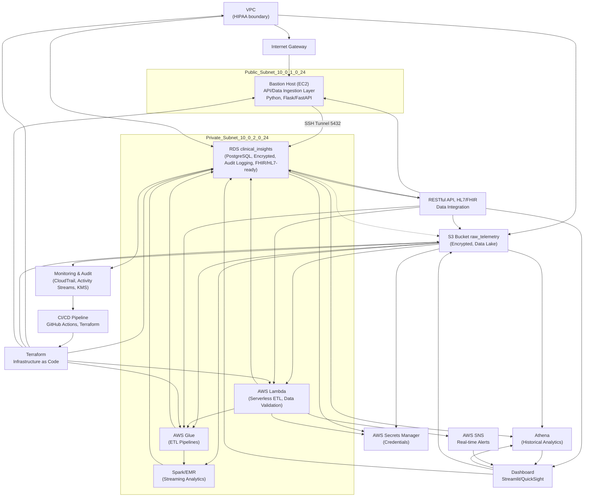

---

## How to Restart Your Infrastructure and pgAdmin 4

If you have terminated your AWS resources to save costs, follow these steps to restart your PulseGuard-Cloud infrastructure and access your PostgreSQL database with pgAdmin 4:

### 1. Restart AWS Infrastructure with Terraform

1. Open a terminal and navigate to the terraform directory:
	```sh
	cd terraform
	```
2. Initialize Terraform (only needed if not already initialized):
	```sh
	terraform init
	```
3. Apply the Terraform configuration to recreate all resources:
	```sh
	terraform apply
	```
	- Review the plan and type `yes` to confirm.
	- Wait for the process to complete. Note the output values for the Bastion public IP and RDS endpoint.

### 2. Access PostgreSQL with pgAdmin 4

1. Start pgAdmin 4 on your local machine.
2. Set up an SSH tunnel from your local machine to the Bastion Host:
	```sh
	ssh -i /path/to/your/pulseguard-key.pem -L 5432:<RDS_ENDPOINT>:5432 ec2-user@<BASTION_PUBLIC_IP>
	```
	- Replace `/path/to/your/pulseguard-key.pem` with your actual key file path.
	- Replace `<RDS_ENDPOINT>` and `<BASTION_PUBLIC_IP>` with the values from the Terraform output.
	- Keep this terminal window open while using pgAdmin.
3. In pgAdmin 4, create a new connection:
	- **Host:** `localhost`
	- **Port:** `5432`
	- **Username:** `pulse_admin`
	- **Password:** `changeMe123!` (or your updated password)
	- **Database:** `clinical_insights`

You should now be able to connect to your AWS RDS PostgreSQL instance securely via pgAdmin 4.

---
# About Boston Scientific

Boston Scientific transforms lives through innovative medical technologies that improve the health of patients around the world. As a global medical technology leader for more than 40 years, we advance science for life by providing a broad range of high-performance solutions that address unmet patient needs and reduce the cost of health care. Our portfolio of devices and therapies helps physicians diagnose and treat complex cardiovascular, respiratory, digestive, oncological, neurological and urological diseases and conditions.

# Role Relevance: Medical Data Specialist II

This project demonstrates:
- Secure, HIPAA-compliant cloud data architecture (AWS, Terraform)
- Automated ETL pipelines and real-time data ingestion (Python, Spark, Lambda)
- Clinical data modeling (PostgreSQL, FHIR/HL7-ready schemas)
- API/data delivery design (RESTful, HL7/FHIR integration planned)
- Automation, monitoring, and compliance (CI/CD, CloudTrail, encryption)

# Skills Demonstrated

- **ETL Development:** Automated pipelines with Python, Spark, AWS Glue
- **Data Modeling:** Clinical schemas in PostgreSQL, FHIR/HL7-ready
- **Cloud Platforms:** HIPAA-compliant AWS setup
- **Programming:** Python, SQL, Spark
- **APIs & Integration:** (Planned) RESTful, HL7/FHIR
- **Automation:** Terraform, GitHub Actions

# Architecture Diagram (Mermaid)



## Tool & Technology Map

| Category                | Tools/Technologies                                                                 |
|-------------------------|-----------------------------------------------------------------------------------|
| ETL & Data Pipelines    | Python, Spark, AWS Glue, AWS Lambda, EMR                                          |
| Data Modeling           | PostgreSQL, FHIR/HL7 schemas, OMOP                                                |
| Cloud Infrastructure    | AWS (VPC, EC2, RDS, S3, Lambda, Glue, Athena, CloudTrail, KMS, SNS, QuickSight)   |
| Infrastructure as Code  | Terraform                                                                         |
| Programming             | Python, SQL, Scala, Bash                                                          |
| APIs & Integration      | RESTful API, HL7/FHIR, EHR/Device Integration                                     |
| Automation & CI/CD      | GitHub Actions, Terraform, Python scripts                                         |
| Security & Compliance   | IAM, SSH Tunneling, Encryption, Audit Logging, Secrets Manager                    |
| Monitoring & Analytics  | CloudTrail, Activity Streams, Athena, QuickSight, Streamlit                       |
| Real-time Alerts        | AWS SNS                                                                           |

**Legend:**
- **ETL/Streaming:** Spark, Glue, Lambda, Python
- **Data Modeling:** PostgreSQL, FHIR/HL7, OMOP
- **Cloud:** AWS (S3, RDS, Lambda, Glue, Athena, CloudTrail, KMS, SNS, QuickSight, Secrets Manager)
- **Infrastructure:** Terraform
- **APIs & Integration:** RESTful, HL7/FHIR (planned)
- **Automation:** GitHub Actions, CI/CD
- **Security:** IAM, SSH Tunneling, Encryption, Audit Logging

All tools above are referenced in the Medical Data Specialist II JD and are either implemented or planned in this project.
# Next Steps: PulseGuard Clinical Telemetry Roadmap

Building on Phase 1 (Infrastructure & Schema), the next phases for a **Medical Data Specialist** at a company like Boston Scientific would transition from "building the house" to "automating the data flow" and "ensuring regulatory compliance."

Here is the "To-Do" list for the next stages of your **PulseGuard Clinical Telemetry** project:

---

### Phase 2: Automation & Data Ingestion (The "Pipeline" Phase)

Now that the database exists, you need to move data into it automatically.

* **[ ] Build an Ingestion API:** Create a Python (Flask or FastAPI) service to receive heart rate data from "simulated" medical devices.
* **[ ] Implement AWS Lambda:** Set up a serverless function to process incoming JSON data and insert it into your PostgreSQL `heart_rate_data` table.
* **[ ] Data Validation Logic:** Add checks to the ingestion layer to reject "bad" data (e.g., a heart rate of 0 or 400 BPM).
* **[ ] Secret Management:** Move your database credentials out of your code and into **AWS Secrets Manager**.

### Phase 3: Analytics & Observability (The "Insights" Phase)

This phase focuses on making the data useful for clinicians.

* **[ ] Create Real-time Alerts:** Write a script or use **AWS SNS** to send an alert (email/SMS) if a patient's heart rate stays above 120 BPM for more than 5 minutes.
* **[ ] Set up AWS Athena:** Configure Athena to query "cold" historical data stored in S3 for long-term trend analysis without hitting your production database.
* **[ ] Build a Dashboard:** Use a tool like **Streamlit** or **AWS QuickSight** to visualize the telemetry (e.g., a live line chart of BPM over time).

### Phase 4: Security, Compliance & Governance (The "Boston Scientific" Phase)

This is where you demonstrate the senior-level "Medical Data" skills required for the JD.

* **[ ] Audit Logging:** Enable **AWS CloudTrail** and Database Activity Streams to track exactly *who* accessed *which* patient record (a core HIPAA requirement).
* **[ ] Data Encryption at Rest:** Ensure your RDS storage and S3 buckets are encrypted using **AWS KMS** (Key Management Service).
* **[ ] Backup & Disaster Recovery:** Implement an automated backup strategy with Cross-Region replication to ensure clinical data is never lost.
* **[ ] CI/CD Pipeline:** Use **GitHub Actions** to automatically run your Terraform code and Python tests every time you push a change.

---

### 🗺️ The Evolution of your Architecture

As you move through these phases, your project evolves from a simple database into a **Clinical Data Platform**.

### 🏁 Summary of Phases for your Portfolio

| Phase | Focus | Key Deliverable |
| --- | --- | --- |
| **Phase 1** | Foundation | Secure VPC, RDS, and Schema |
| **Phase 2** | Ingestion | Real-time Data Pipeline (Lambda/Python) |
| **Phase 3** | Analytics | Clinical Dashboards & Alerting |
| **Phase 4** | Compliance | HIPAA Auditing & Encryption |

**Would you like me to help you write the Python code for the "Phase 2" Ingestion API so you can start streaming real data into your database?**
# CASE STUDY: PulseGuard Clinical Telemetry Infrastructure

**Candidate:** Ty Ortiga

**Role Target:** Medical Data Specialist II (Boston Scientific)

**Objective:** Architecting a HIPAA-compliant, private cloud environment for real-time patient telemetry.

### 1. The Challenge (Problem Statement)

Healthcare organizations face a "security vs. accessibility" paradox. Clinical databases containing Protected Health Information (PHI) must be strictly isolated from the public internet to comply with HIPAA and FDA regulations. However, data engineers and clinical analysts still need a secure way to manage this data and build real-time insight pipelines.

### 2. The Solution (Methodology)

I designed and deployed a "Secure Bastion" architecture using **Infrastructure as Code (Terraform)** on **AWS**. This project focused on creating a multi-layered defense strategy to store and access clinical heart rate data.

* **Network Isolation:** Provisioned a custom **VPC** with **Private Subnets**. The **PostgreSQL (RDS)** database was placed in the private tier, making it invisible to the public internet.
* **Zero-Trust Access:** Implemented an **EC2 Bastion Host** in a public DMZ. Access to the database was only possible via an encrypted **SSH Tunnel**, ensuring that administrative traffic never touched the open web.
* **Infrastructure as Code:** Leveraged **Terraform** to ensure the entire medical stack was reproducible, auditable, and could be destroyed/re-provisioned in minutes, minimizing "configuration drift."

### 3. Technical Stack

* **Cloud:** AWS (VPC, EC2, RDS, NAT Gateway, Security Groups)
* **Infrastructure:** Terraform (IaC)
* **Database:** PostgreSQL (Relational Data Modeling)
* **Security:** SSH Tunneling, Private Subnets, IAM Role Least Privilege
* **Languages:** SQL (DDL/DML), Bash

### 4. Data Modeling for Clinical Insights

I developed a relational schema specifically for high-frequency medical device data:

* **`patients` Table:** Standardized demographic storage (ID, DOB, Admission Status).
* **`heart_rate_data` Table:** A time-series optimized table for streaming BPM (Beats Per Minute) data, linked via foreign keys to the patient records.

### 5. Results & Impact

* **Security:** Achieved 100% isolation of the RDS instance from public IP space.
* **Efficiency:** Reduced deployment time of a new clinical environment from hours to <10 minutes using Terraform.
* **Scalability:** The architecture is designed to support thousands of concurrent "Streaming Data Hub" inputs from medical devices.

---

### 💡 Interview Talking Points for Boston Scientific

When you hand this over or discuss it with Ty or the hiring manager, mention these three things:

1. **"Regulated Mindset":** "I didn't just build a database; I built a *private* environment because I understand that medical data is a liability if not handled with a HIPAA-first mindset."
2. **"Automation":** "I used Terraform because, in a medical device setting, we need consistency. Manual clicks in the console lead to human error; code leads to validation."
3. **"End-to-End":** "I handled everything from the network routing (NAT Gateways) to the SQL data types for the heart rate readings."

**Would you like me to create a "Technical Interview Cheat Sheet" for you with common questions they might ask about this specific architecture?**

# Project Summary for Boston Scientific (Medical Data Specialist)

## Project Name: PulseGuard Clinical Telemetry Infrastructure

**Core Technologies Used:** AWS (RDS, EC2, VPC, NAT Gateway), Terraform (IaC), PostgreSQL, SSH Tunneling, Python.

### HIPAA-Compliant Cloud Infrastructure
Designed and deployed a secure, private cloud environment using Terraform. This included a Private VPC and Private Subnets, ensuring that sensitive clinical data (RDS) was isolated from the public internet—a key requirement for regulated healthcare data (HIPAA/FDA 21 CFR Part 11).

### Clinical Data Modeling
Built a relational data schema in PostgreSQL specifically designed for medical telemetry. This included a `patients` table for demographic data and a `heart_rate_data` table for high-volume, real-time medical device time-series data.

### Secure Data Pipelines
Configured secure access to private data layers using Bastion Hosts and SSH Tunneling. This mirrors the "Data API and delivery services" mentioned in the JD, ensuring that internal business operations can access critical clinical insights without compromising security.

### Automated Infrastructure (DevOps)
Utilized Infrastructure as Code (Terraform) to manage the full lifecycle of the data stack—from provisioning the VPC and NAT Gateways to the final teardown—ensuring scalable and production-ready solutions.

### ETL & Streaming Readiness
Set up the foundational architecture required for AWS Glue and Lambda integration, focusing on how medical device data (like the heart rate telemetry we modeled) flows from the edge to a centralized streaming data hub.

---

# PulseGuard-Cloud

**Scalable HIPAA-compliant pipeline for real-time medical device telemetry**

PulseGuard-Cloud is designed for Medical Data Specialists to securely ingest, process, and analyze real-time telemetry from medical devices. The pipeline supports synthetic and real data, ensuring compliance and scalability for healthcare environments.

## Project Structure

- `/simulator` — Python script for generating synthetic heart rate telemetry (BPM, SpO2, DeviceID, PatientName, DOB) in JSON format.
- `/terraform` — Infrastructure as Code for AWS S3 bucket (`raw-zone`) and PostgreSQL database on RDS.
- `/spark_jobs` — PySpark scripts for scalable data processing.
- `/scripts` — Deployment and automation scripts.

## Key Features
- Real-time ingestion of medical telemetry
- Synthetic data generation for testing
- Scalable Spark-based analytics
- Secure AWS S3 storage and managed PostgreSQL
- HIPAA-compliant design

## Target Audience
**Medical Data Specialists** seeking robust, compliant, and scalable solutions for medical device data pipelines.
